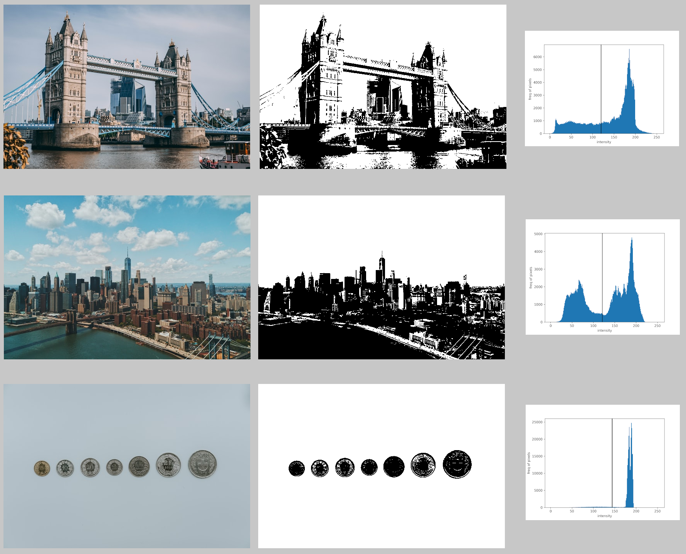
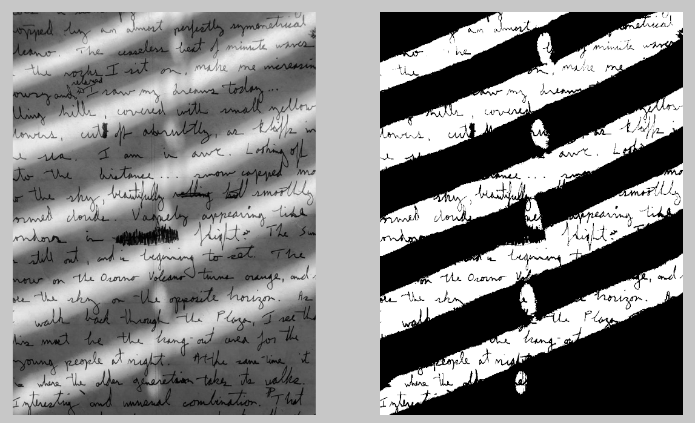
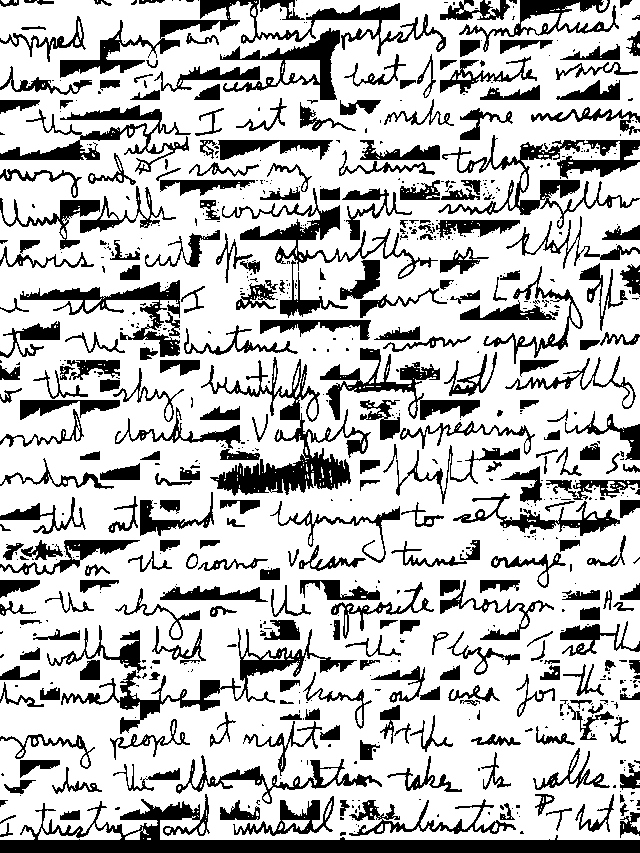

# Binarization

Converting an image into a binary image. Can be used for segmentation, text isolation etc.

## Otsu's Binarization

Binarization using the [Otsu's adaptive thresholding agorithm](https://en.wikipedia.org/wiki/Otsu%27s_method). Sweeps over all thresholds and selects an optimal global threshold for the image.

## Examples

### Text extraction

Otsu's binarization being used for text extraction

All images taken from [Unsplash](https://unsplash.com). 
+ Image of [Tower bridge by Charles Postiaux](https://unsplash.com/photos/Q6UehpkBSnQ)
+ Image of [Brooklyn bridge by Patrick Tomasso](https://unsplash.com/photos/SVVTZtTGyaU)
+ Image of [Coins by Claudio Schwarz](https://unsplash.com/photos/a_DfqkONlm8)
+ Image of [White printed paper by Annie Spratt](https://unsplash.com/photos/a_DfqkONlm8)
+ Image of [Handwritten text by Micah Boswell](https://unsplash.com/photos/00nHr1Lpq6w)

## Drawbacks

As it uses a global threshold, might not do well in situations with uneven illumination. 

## Localized Otsu's algorithm

A local threshold can be determined for different parts of the image using Otsu's algorithm to partially solve the problems caused by uneven illumination.

here one can see that the algorithm has managed to isolate all the text but has caused artifacts in the background regions.