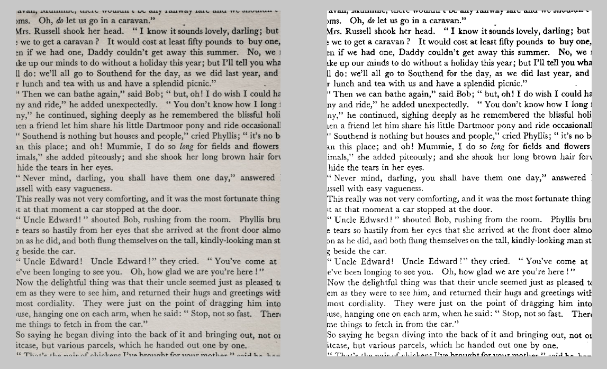

# Binarization

Converting an image into a binary image. Can be used for segmentation, text recognition etc.

## Otsu's Binarization

Binarization using the [Otsu's adaptive thresholding agorithm](https://en.wikipedia.org/wiki/Otsu%27s_method). Sweeps over all thresholds and selects an optimal global threshold for the image.

## Examples

### Text extraction

Otsu's binarization being used for text extraction

All images taken from [Unsplash](https://unsplash.com). 
+ Image of [Tower bridge by Charles Postiaux](https://unsplash.com/photos/Q6UehpkBSnQ)
+ Image of [Brooklyn bridge by Patrick Tomasso](https://unsplash.com/photos/SVVTZtTGyaU)
+ Image of [Coins by Claudio Schwarz](https://unsplash.com/photos/a_DfqkONlm8)
+ Image of [White printed paper by Annie Spratt](https://unsplash.com/photos/a_DfqkONlm8)